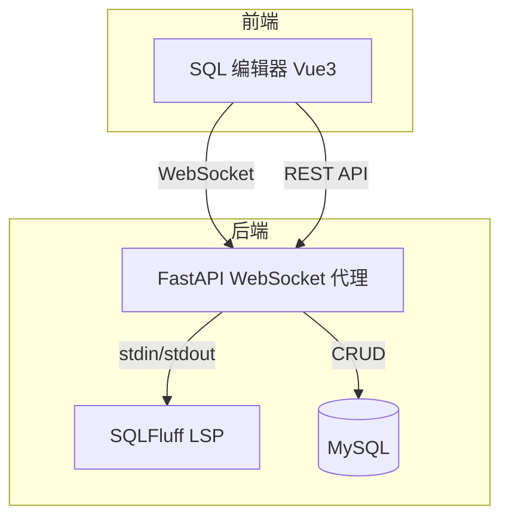
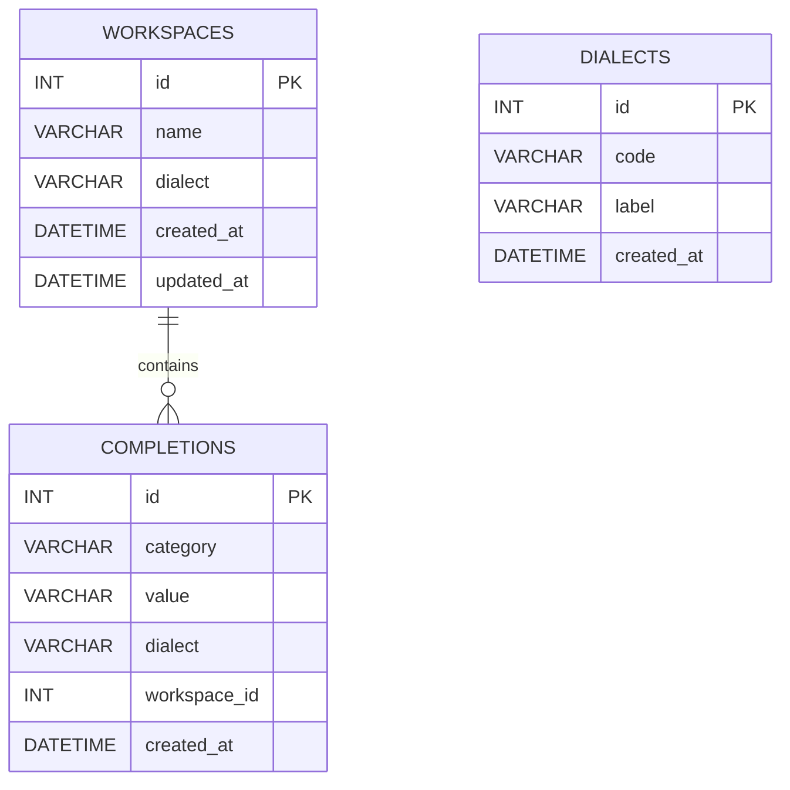

## 系统架构

## ER 图

## 接口清单

### HealthController
- GET /api/health

### WorkspaceController
- GET /api/workspaces
- POST /api/workspaces
- PUT /api/workspaces/{workspace_id}
- DELETE /api/workspaces/{workspace_id}

### DialectController
- GET /api/dialects

### CompletionController
- GET /api/completions
- POST /api/completions

### LspController
- WS /ws/lsp

## UI/UX 规范

- 主色调: #3B82F6
- 背景色: #F5F7FB
- 字体色: #1F2937
- 卡片圆角: 16px
- 阴影: 0 10px 30px rgba(15, 23, 42, 0.08)
- 全局间距: 8px / 16px / 24px
