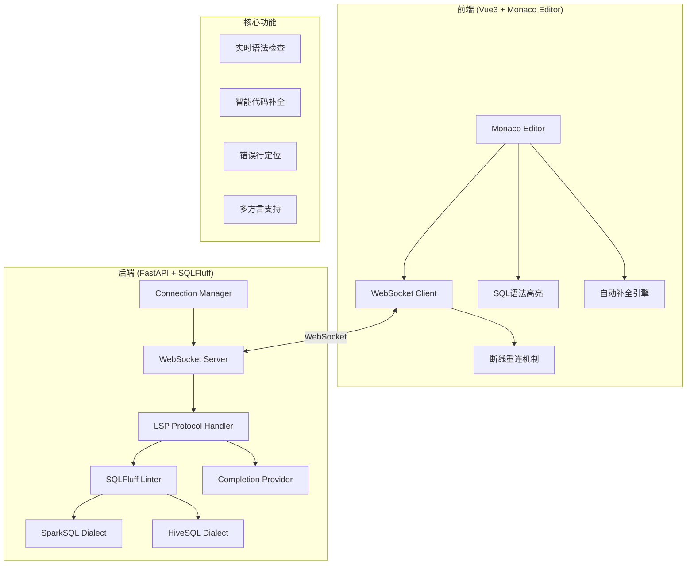

# SQLFluff LSP SQL Editor 项目设计文档

## 1. 系统架构



## 2. 模块设计

### 2.1 后端模块结构

```
backend/
├── app/
│   ├── __init__.py
│   ├── main.py                 # FastAPI应用入口
│   ├── config.py               # 配置管理
│   ├── core/
│   │   ├── __init__.py
│   │   ├── logging.py          # 日志配置
│   │   └── exceptions.py       # 全局异常处理
│   ├── services/
│   │   ├── __init__.py
│   │   ├── lsp_service.py      # LSP服务核心
│   │   ├── linter_service.py   # SQLFluff Linter封装
│   │   └── completion_service.py # 代码补全服务
│   ├── websocket/
│   │   ├── __init__.py
│   │   ├── manager.py          # WebSocket连接管理
│   │   ├── handler.py          # 消息处理器
│   │   └── protocol.py         # LSP协议实现
│   └── models/
│       ├── __init__.py
│       └── schemas.py          # Pydantic模型
├── tests/
│   ├── __init__.py
│   ├── test_linter.py
│   ├── test_completion.py
│   └── test_websocket.py
├── requirements.txt
└── Dockerfile
```

### 2.2 前端模块结构

```
frontend-user/
├── src/
│   ├── main.ts
│   ├── App.vue
│   ├── api/
│   │   └── websocket.ts        # WebSocket客户端
│   ├── stores/
│   │   ├── editor.ts           # 编辑器状态管理
│   │   └── connection.ts       # 连接状态管理
│   ├── views/
│   │   └── EditorView.vue      # 主编辑器视图
│   ├── components/
│   │   ├── SqlEditor.vue       # Monaco编辑器组件
│   │   ├── StatusBar.vue       # 状态栏组件
│   │   ├── DiagnosticsPanel.vue # 错误面板
│   │   └── DialectSelector.vue # 方言选择器
│   ├── utils/
│   │   ├── monaco-config.ts    # Monaco配置
│   │   ├── sql-completion.ts   # SQL补全逻辑
│   │   └── reconnect.ts        # 断线重连
│   └── styles/
│       ├── variables.scss
│       └── global.scss
├── package.json
├── vite.config.ts
└── Dockerfile
```

## 3. 接口设计

### 3.1 WebSocket消息协议

#### 客户端 -> 服务端

| 消息类型 | 说明 | 参数 |
|---------|------|------|
| `textDocument/didOpen` | 打开文档 | `uri`, `languageId`, `text` |
| `textDocument/didChange` | 文档变更 | `uri`, `contentChanges` |
| `textDocument/completion` | 请求补全 | `uri`, `position` |
| `setDialect` | 设置SQL方言 | `dialect` |

#### 服务端 -> 客户端

| 消息类型 | 说明 | 参数 |
|---------|------|------|
| `textDocument/publishDiagnostics` | 诊断结果 | `uri`, `diagnostics[]` |
| `completion/response` | 补全结果 | `items[]` |
| `error` | 错误信息 | `code`, `message` |

### 3.2 诊断消息结构

```json
{
  "jsonrpc": "2.0",
  "method": "textDocument/publishDiagnostics",
  "params": {
    "uri": "file:///editor.sql",
    "diagnostics": [
      {
        "range": {
          "start": {"line": 0, "character": 0},
          "end": {"line": 0, "character": 10}
        },
        "severity": 1,
        "code": "L001",
        "source": "sqlfluff",
        "message": "Unnecessary trailing whitespace."
      }
    ]
  }
}
```

## 4. UI/UX 规范

### 4.1 色彩系统

| 用途 | 颜色值 | 说明 |
|------|--------|------|
| 主色调 | `#1890ff` | 品牌蓝 |
| 成功色 | `#52c41a` | 操作成功 |
| 警告色 | `#faad14` | 警告提示 |
| 错误色 | `#ff4d4f` | 错误提示 |
| 背景色 | `#f0f2f5` | 页面背景 |
| 卡片背景 | `#ffffff` | 卡片/面板 |
| 编辑器背景 | `#1e1e1e` | VS Code Dark |
| 边框色 | `#d9d9d9` | 分隔线 |

### 4.2 字体规范

- **代码字体**: `'Fira Code', 'Consolas', 'Monaco', monospace`
- **UI字体**: `'-apple-system', 'BlinkMacSystemFont', 'Segoe UI', 'Roboto', sans-serif`
- **字号**: 
  - 代码: 14px
  - 正文: 14px
  - 标题: 16px/18px/20px

### 4.3 间距规范

- 基础单位: 8px
- 常用间距: 8px / 16px / 24px / 32px
- 卡片圆角: 8px
- 按钮圆角: 4px

### 4.4 交互规范

- 按钮 Hover: 透明度变化或颜色加深
- Loading 状态: 使用 Spin 组件
- 操作反馈: 使用 Message 组件
- 错误高亮: 红色波浪下划线 + Hover提示

## 5. 性能要求

| 指标 | 要求 |
|------|------|
| 语法检查响应时间 | < 200ms |
| WebSocket重连间隔 | 1s -> 2s -> 4s (指数退避) |
| 最大重连次数 | 10次 |
| 防抖延迟 | 300ms |

## 6. 支持的SQL方言

- **SparkSQL**: Spark SQL语法规则
- **HiveSQL**: Hive SQL语法规则
- **ANSI**: 标准SQL语法 (默认)

## 7. 错误码定义

| 错误码 | 说明 |
|--------|------|
| 1001 | WebSocket连接失败 |
| 1002 | LSP服务不可用 |
| 1003 | 无效的SQL方言 |
| 1004 | 解析超时 |
| 1005 | 内部服务错误 |
